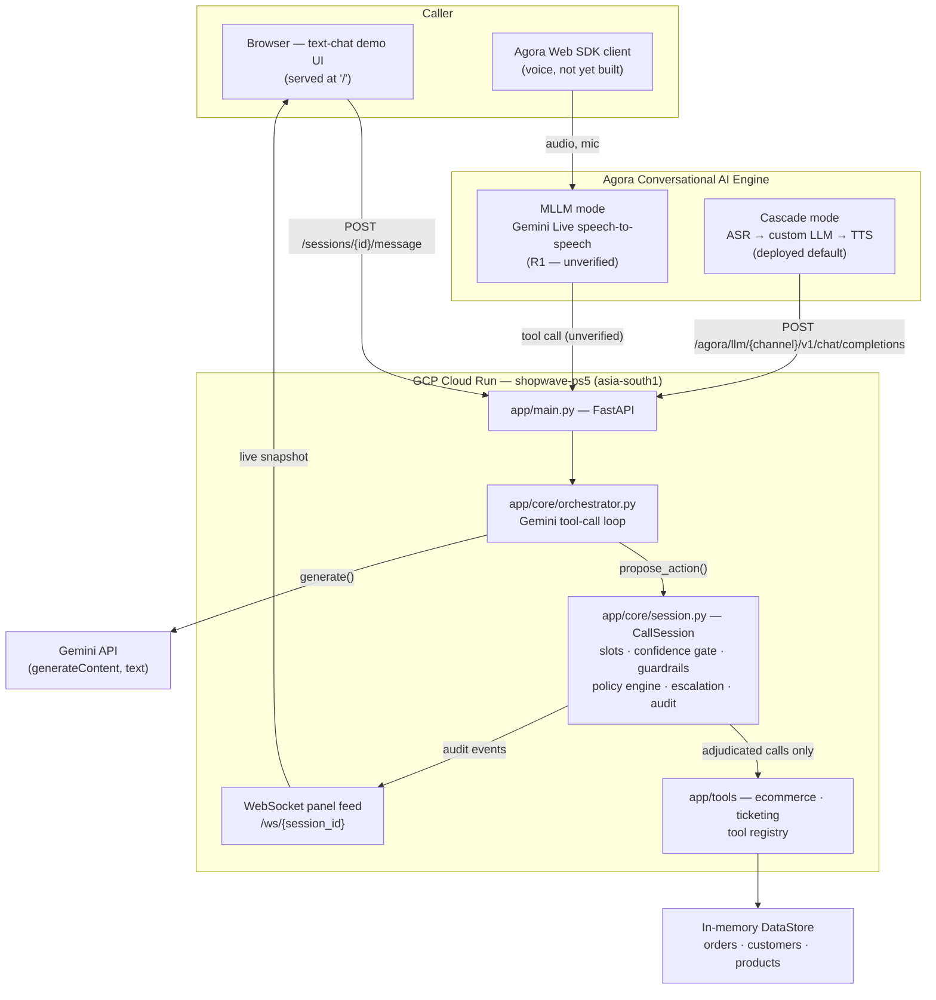

# Architecture

## Concept

**A multilingual voice support line where the caller never repeats themselves, never gets
transferred into a void, and never gets told a confident lie.**

Three UX principles — these are also the three things judges should remember:

1. **Never make the caller repeat themselves.** Everything confirmed stays confirmed —
   through corrections, through topic changes, and critically *through the escalation*.
2. **Say what you're sure of, out loud.** Confidence is spoken, not buried in a log.
   Critical fields go through a read-back ladder in the caller's own language. When unsure,
   the agent says so instead of guessing.
3. **Escalation is an addition, not a transfer.** The human joins the call. The AI stays as
   interpreter and copilot with the case file already filled in.

---

## System diagram

```
 caller ──audio──> Agora RTC channel ──> Agora Conversational AI agent
 (web client)      remote_rtc_uids:["*"]     (Gemini Live, MLLM mode)
 AI noise supp.    agora_vad turn detect          │
 Agora Web SDK                                    │ tool call
                                                  ▼
                                          ┌──────────────────┐
                                          │  ShopWave Core   │
                                          ├──────────────────┤
                                          │ slot manager     │  NEW
                                          │ confidence gate  │  NEW
                                          │ question planner │  NEW
                                          │ language state   │  NEW
                                          │ escalation packet│  NEW
                                          ├──────────────────┤
                                          │ rule/intent eng. │  retained
                                          │ context enrich   │  retained
                                          │ policy engine    │  retained
                                          │ idempotency      │  retained
                                          │ fraud detection  │  retained
                                          │ tool orchestrator│  retained
                                          │ audit logger     │  retained
                                          └────────┬─────────┘
                                                   │
                                    allowed? ──no──┴──> spoken refusal + escalate
                                          │yes
                                          ▼
                                   tool executes ──> ticketing (Zendesk/Freshdesk)
                                          │
                        audit log ──WebSocket──> transparency panel
                                          │
                        escalation ────────> agent console
                                             │ "Join call"
                                             ▼
                                     human joins SAME channel
                                     agent config updated → interpreter mode
                                     three parties, one room
```

---

## The transport decision

ShopWave Core is **transport-agnostic**: it exposes one internal decision API, and two thin
adapters sit in front of it.

### Primary — MLLM (Gemini Live)

```jsonc
{
  "mllm": {
    "vendor": "gemini",
    "model": "gemini-3.1-flash-live-preview",
    "instructions": "<persona, language mirroring, confirmation ladder, boundaries, AI disclosure>",
    "voice": "Charon",
    "input_modalities": ["audio"],
    "output_modalities": ["audio"],
    "transcribe_user": true,      // critical — feeds panel + audit log
    "transcribe_agent": true,
    "turn_detection": { /* agora_vad */ }
  }
}
```

Native speech-to-speech. No ASR/TTS chain — enabling MLLM automatically disables `asr`,
`llm` and `tts`. Voice-to-voice across 70+ languages. Far better code-switching,
interruption handling and prosody; sub-second latency.

**`transcribe_user` / `transcribe_agent` are the load-bearing flags** — they're how
transcripts reach the transparency panel and audit log even in speech-to-speech mode.

**Open risk:** function calling is undocumented in Agora's Gemini Live MLLM integration.
Gemini Live supports tools natively; whether Agora passes tool declarations through is
unverified. See R1.

### Fallback — Cascade (custom LLM)

```
asr (Azure 100+ langs / Deepgram 50+ / Agora ARES 36)
  → llm.vendor: "custom"   ← ShopWave's OpenAI-compatible /chat/completions endpoint
  → tts
```

With `llm.vendor: "custom"`, Agora sends OpenAI-format requests to *your* service and
includes `turn_id` and `timestamp` metadata per turn. Function calling fully documented.
ShopWave literally becomes the LLM.

Costs: serial latency, less natural prosody, and mid-sentence Hinglish degrades because
`asr.language` is set per-agent.

**Decision rule:** ship MLLM if the tool-calling test passes, cascade if it doesn't.
The brain never changes either way.

---

## Components

### 1. Transport — Agora RTC channel

One channel per call.

- `remote_rtc_uids: ["*"]` — the agent subscribes to **every** user in the channel, so it
  keeps hearing everyone after the human agent joins. (Docs note that multiple agents in one
  channel with `["*"]` can prevent `idle_timeout` from firing — not an issue for us since we
  run one agent, but review `idle_timeout` best practice to avoid runaway cost.)
- **Agora AI noise suppression** on the client. This satisfies PS5's background-noise
  resilience requirement *using Agora's own technology* rather than a third-party denoiser —
  which scores directly against "use of Agora technologies."
- `agora_vad` turn detection — compatible with both cascade and MLLM modes.

### 2. Conversation — Agora CAI + Gemini Live

The system instruction carries: persona, language-mirroring rules, confirmation ladder
policy, refusal boundaries, and the AI disclosure.

### 3. Brain — ShopWave Core

**Retained from ShopWave** — rule/intent engine with LLM fallback, context enrichment,
policy engine, tool orchestration, idempotency, fraud detection, audit logger. The rule
engine is what makes broad intent coverage cheap.

**New for PS5** — this is what makes it a new project rather than a resubmission:

#### Slot manager
Every critical field carries a state machine:

```
unheard → heard(confidence) → read-back → confirmed
```

**Only `confirmed` slots may feed a tool call.** This is the UX centrepiece.

#### Confidence gate
Combines transcript confidence with *semantic plausibility* — does this order ID actually
exist in the system? Below threshold, it re-asks rather than guessing. This is what makes
"low-confidence detection" real rather than a prompt instruction.

#### Prioritised question planner
Asks whichever field most reduces uncertainty next, rather than walking a fixed script.
PS5 requires this explicitly (requirement 6) and most teams will hardcode a sequence.

#### Language state
Tracks the caller's language per turn and mirrors it, while keeping entity values
language-neutral (an order ID is an order ID regardless of the surrounding language).

#### Escalation packet builder
Structured handoff: confirmed slots, unconfirmed slots, what was attempted, why it stopped.

### 4. Human agent console

- Live translated transcript
- The case file, with confirmed vs unconfirmed fields visually distinguished
- The reason for escalation
- **"Join call"** — puts the human into the same Agora channel
- On join, the agent's configuration is switched to **interpreter mode** via Agora's
  *update agent configuration* REST endpoint, live, mid-call
- Approve / deny for actions the AI was blocked from taking

### 5. Transparency panel — the judge surface

Streaming per turn over WebSocket:

- Detected language + code-switch markers
- Slot board: each critical field with confidence and state
- Policy decisions, showing **which rule fired**
- Tool calls with latency
- Interruption events
- Audit entries

**Escalations are colour-coded two ways: "escalated by design" vs "escalated due to low
confidence."** ShopWave's original thesis was that support AI fails by bouncing ~80% of
actionable tickets to humans — so this distinction turns your escalation rate from an
apparent weakness into a stated design position.

### 6. Ticketing

ShopWave already emits structured tickets. Wire to a real **Zendesk or Freshdesk sandbox**
rather than a spreadsheet or JSON file — "external tool integration" is a scored requirement
and a real SaaS integration reads far better under questioning.

---

## Stack

| Layer | Choice | Note |
|---|---|---|
| Voice transport | Agora RTC + Conversational AI Engine | Mandatory |
| Model | Gemini Live (`gemini-3.1-flash-live-preview`) | Fallback: Gemini via custom LLM endpoint |
| Backend | Python + **FastAPI** | Async + WebSockets; ShopWave's own roadmap called for this |
| Models | Pydantic | Carried over from ShopWave unchanged |
| Frontend | React + Agora Web SDK (planned) | Three surfaces: caller, console, panel. The text-chat demo UI live today is a single inline page served by `app/main.py`, not React — it exists to make the brain judge-reachable before the full caller/console/panel frontend is built |
| Ticketing | Zendesk / Freshdesk sandbox | Real integration |
| Deploy | **GCP Cloud Run** | Live and publicly reachable — see [docs/09-deployment.md](09-deployment.md) |

---

## Deployed system diagram (1 Sep 2026)

What's actually running today, as opposed to the planned end-state above. Cascade mode
(bottom path) is the deployed default; MLLM (top path) is unverified until real Agora
credentials are wired in — see R1 in [docs/04-risks-and-open-questions.md](04-risks-and-open-questions.md).



Where this diverges from the target-state diagram above: no React frontend or human-agent
console yet (escalation/interpreter-mode endpoints exist in `app/main.py` and are tested,
but nothing calls them from a UI), and ticketing is `app/tools/ticketing.py`'s sandbox
implementation rather than a real Zendesk/Freshdesk integration.

---

## Latency budget

Target **under 1.5s** round trip. The confirmation ladder adds conversational turns, so each
turn must be fast — otherwise the UX inverts and the ladder becomes the thing that makes the
call frustrating rather than trustworthy.
